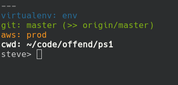

# PS1

My custom PS1 prompt.

Includes:
* Currently selected AWS profile
* Git branch if in a git repo directory
* Summary of current git status if in a git repo
* Current python virtualenv
* Username, hostname and current path

It's extensible and customisable. Have a look at `plugins.sh`

It looks like this:

## Usage

Put the following somewhere in your .bashrc

    ps1_prompt="\u> "  # Or whatever you like to have on the input line
    . /path/to/ps1.sh
